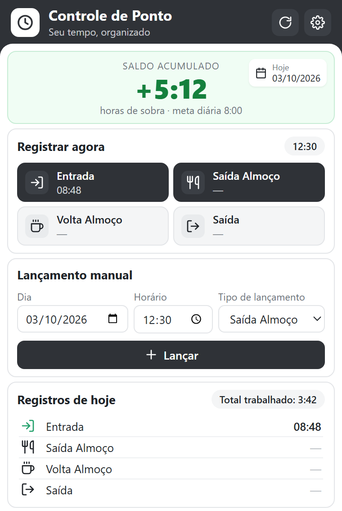
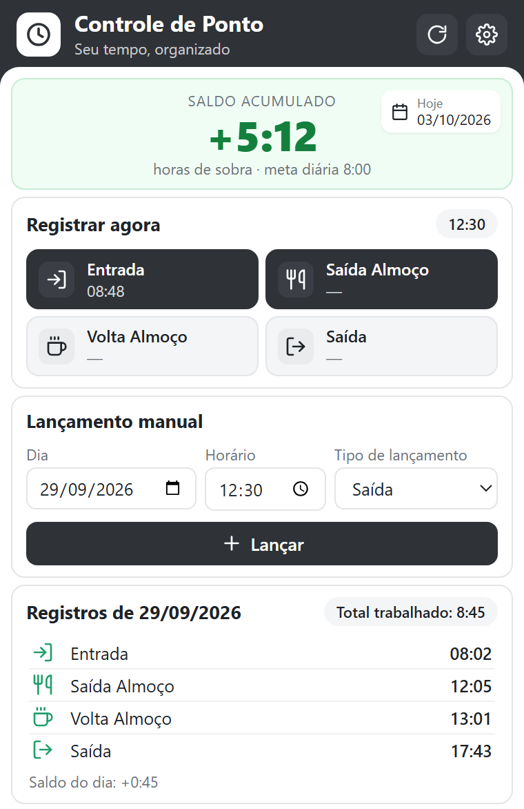
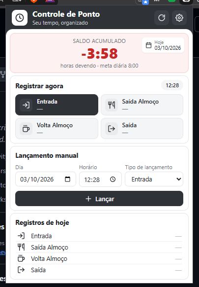
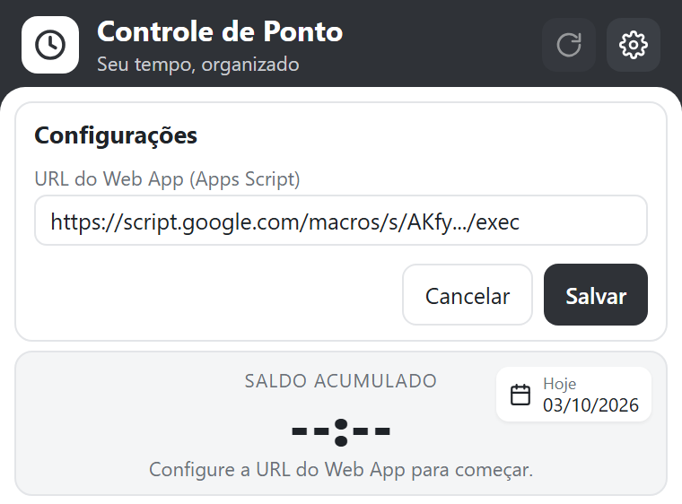

# Controle de Ponto

Extensão do Chrome para registrar o ponto do dia e acompanhar o banco de horas, usando uma planilha do Google Sheets como base de dados. Feita para uso pessoal: sem servidor, sem login, sem custo.

<p align="center">
  
  &nbsp;
  
  &nbsp;
  
</p>

## Funcionalidades

- **Saldo acumulado** do banco de horas em destaque: verde quando há horas de sobra, vermelho quando há horas devendo.
- **Registrar agora:** um clique registra Entrada, Saída Almoço, Volta Almoço ou Saída com o horário atual. O próximo registro esperado do dia fica destacado.
- **Lançamento manual:** escolha dia, horário e tipo para corrigir ou lançar um ponto esquecido. Pede confirmação antes de substituir um horário que já existe e não aceita datas futuras.
- **Registros do dia:** mostra os 4 horários da data selecionada, o total trabalhado (contando ao vivo enquanto o dia está em andamento) e o saldo do dia quando está completo.
- **Planilha sempre coerente:** dias lançados fora de ordem entram na posição cronológica correta, e editar um horário direto na planilha recalcula os totais automaticamente.

## Como funciona

```
Extensão do Chrome ──GET/POST──▶ Google Apps Script (Web App) ──▶ Google Sheets
   (popup)                          Code.gs                         aba "Ponto"
```

- O **Apps Script** (`Code.gs`) fica vinculado à planilha e é publicado como Web App. Ele grava os horários, calcula os totais e devolve um resumo em JSON.
- A **extensão** (`extensao/`) consome esse Web App. A URL dele é configurada no próprio popup e fica salva no `chrome.storage`.
- O **`index.html`** é uma alternativa mais simples, sem extensão: uma página com os 4 botões que só registra o ponto.

### Estrutura da planilha

| Data | Entrada | Saída Almoço | Volta Almoço | Saída | Horas Trabalhadas | Saldo do Dia | Saldo Acumulado |
|------|---------|--------------|--------------|-------|-------------------|--------------|-----------------|
| 2026-09-29 | 08:02:00 | 12:05:00 | 13:01:00 | 17:43:00 | 8:45 | +0:45 | +5:12 |

As três últimas colunas são calculadas pelo script. A meta diária de horas fica na célula **K1** (padrão 8,8h = 8h48min) e pode ser alterada a qualquer momento. O exemplo acima usa meta de 8h.

## Instalação

O passo a passo completo está em [SETUP.md](SETUP.md). Em resumo:

1. **Planilha e Apps Script:** crie uma planilha no Google Sheets, abra *Extensões → Apps Script*, cole o conteúdo de [`Code.gs`](Code.gs) e publique como **App da Web** (executar como você, acesso "Qualquer pessoa"). Copie a URL `.../exec` gerada.
2. **Extensão:** abra `chrome://extensions`, ative o *Modo do desenvolvedor*, clique em *Carregar sem compactação* e selecione a pasta [`extensao/`](extensao).
3. **Configuração:** abra a extensão, cole a URL do Web App e clique em Salvar.

<p align="center">
  
</p>

Para usar o `index.html` em vez da extensão, copie `config.example.js` para `config.js` e coloque a URL nele.

> Sempre que alterar o `Code.gs`, publique uma **nova versão** em *Implantar → Gerenciar implantações*. A URL continua a mesma.

## Estrutura do repositório

```
├── Code.gs              # Apps Script: grava pontos, calcula totais e expõe o Web App
├── extensao/            # Extensão do Chrome (Manifest V3)
│   ├── manifest.json
│   ├── popup.html / popup.css / popup.js
│   ├── api.js           # Configuração e chamadas ao Web App
│   └── icons/
├── index.html           # Alternativa simples sem extensão
├── config.example.js    # Modelo de configuração do index.html
├── docs/prints/         # Imagens deste README
└── SETUP.md             # Guia completo de configuração
```

## Segurança

A URL do Web App funciona como uma senha: quem tiver a URL consegue ler e gravar registros na planilha. Por isso ela não é versionada: o `config.js` está no `.gitignore` e a extensão guarda a URL só no navegador. Não compartilhe essa URL.

## Tecnologias

- Google Apps Script + Google Sheets
- Extensão Chrome Manifest V3 em JavaScript puro (sem dependências nem build)
